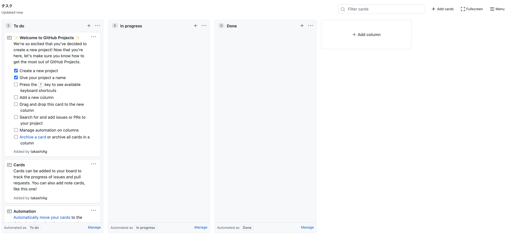

# github-issues-flow

github などでブランチをきる基準などを定義します。


## 流れ

1. github にレポジトリを作成
1. タスクを割り当てる(PM や PL が行う作業)
1. タスクをこなす。(作業者の作業)
1. レビューを行う
1. マージする。

# 細かな流れ

## github のレポジトリを作成

作業者は新しくレポジトリを作成し、push をしておく。
下記の流れを必ず行ってください。

1.  git のレポジトリを作成
1.  README.md をして push
1.  ローカルで develop ブランチを作る
1.  github のデフォルトブランチを develop にする。

# やることリストを作成する

主に PM や PL が行う作業で、プロジェクトに必要なタスクをまとめ、ToDo へと登録を行う。

## github project を使ってカンバンボードを作成

今回使用するレポジトリに移動し、上部のタブから、projects へ移動。
右上のボタンを押下し、プロジェクトを作成

プロジェクトの名前やテンプレートを選び、プロジェクト画面下部のボタンを押下し、プロジェクトを作成する。


## カンバンボードにカンバン(タスク)を作成していく

github project が作成された。
これは trello などのタスク管理アプリと同じようにカンバン(タスク)を追加していくことができる。


## タスクを追加し、issue に変換する

タスクの+ボタンを押下し、プロジェクトに新しいカンバンを登録する。


issue に変換する。


github の issue には番号が振られる。担当者の割り当てやラベルを登録でき、便利。


# 作業を行う

実際に PM や PL が作成したタスクを作業して消化してく。

## github からレポジトリを pull してくる

作業を開始する前に、該当作業の issue 番号を確認しておく。
作業を開始する前に他作業者の変更をダウンロードしておくと便利

```bash
# 作業開始前
## 作業を開始する前に他作業者の変更をダウンロードしておく。
git switch develop
git pull

## 事前に確認しておいたissue番号を元にブランチを作成する。
git switch -c issue/\#{issue番号}

# コードの修正などを行う
# 機能追加やUIの修正など

# コードの修正後はstageに追加し、コミットを作成する。
git add {作業を行ったファイル}
git commit -m "feat: 機能Aを作成した。: fix #{issue番号}"
git push --set-upstream origin issue/#{issue番号}
```

## github 上にアクセスし、pull request を行う。

github にアクセスすると、上の方にプルリクエストのボタンが出てきている。


クリックすると次のような画面が表示されているため、いい感じにコメントを入力しプルリクエストを作成する。


conflict が発生した場合は、修正しましょう。

作業は一旦以上です。
次の作業に取り掛かってください。

# レビューを行う

作業者がプルリクエスト(変更の取り込みのリクエスト)を送ったあと、その変更が正しかったのか、確認を行います。
右上の file changed のボタンからレビューを行いましょう。
変更が必要な場合、change request を投げる。
変更が必要ない場合、approve をする。
